# App Marketing Campaigns Analysis

## Overview
This is an analysis of marketing campaigns from a mobile app company where I calculate key marketing metrics like cost per acquired customer (CAC) and Return on Investment (ROI).

SQL was used aggregate the data and calculate the different metrics. Python/Pandas were used to create the visualizations which found in the `visualizations.ipynb` jupyter notebook. 

## Data

The marketing dataset used for this analysis contained the following three tables stored in an SQL server:

&nbsp;&nbsp;&nbsp;&nbsp;**1. costs:** The cost per day of running advertising campaigns on different advertising networks.

&nbsp;&nbsp;&nbsp;&nbsp;**2. installs:** Records of users installing our app, with the date and the source advertising network and campaign.

&nbsp;&nbsp;&nbsp;&nbsp;**3. subscriptions:** Records of users purchasing a subscription, with the initial payment amount and date.

The result of the calculations performed using SQL queries were stored as CSV files inside of the `Data` folder.


## Insights & Analysis

### 1. How many installs were there, per day, per campaign and per network?

*Note: Duplicate entries were not removed and entries without a "userid" (i.e. Null) were treated as unique installs.*

#### A. Number of installs per day:

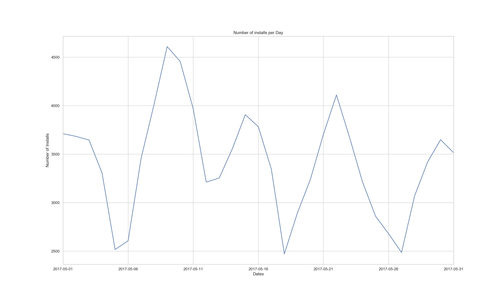

**Observations:** Over the period of a month, the number of installs fluctuated a lot. It would be worth to find out if the peak days correlate to the amount of money spent on campaigns or if there is an specific platform or country that were targeted the most, if so, the team should continue to invest money on them until they are no longer viable. Similarly, we should try to find any significant trends that caused the three lowest drops (less than 26,000 installs).

**SQL Query:**
```sql
SELECT date, COUNT(userid) AS num_installs
FROM installs
GROUP BY date
ORDER BY num_installs DESC;
```

#### B. Number of installs per Campaign:

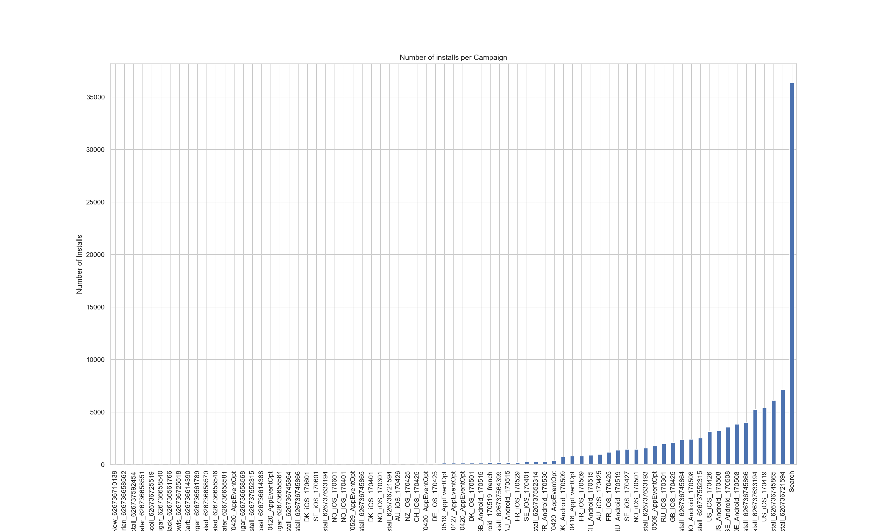

**Observations:** As we can see, over 30% of the installs came from the "Search" campaign. Although this could be interpreted as a good sign, it is important to find out what fraction of those users became paying customers. 

**SQL Query:**
```sql
SELECT campaign, COUNT(userid) AS num_installs
FROM installs
GROUP BY campaign
ORDER BY num_installs DESC;
```


#### C. Number of installs per Network:

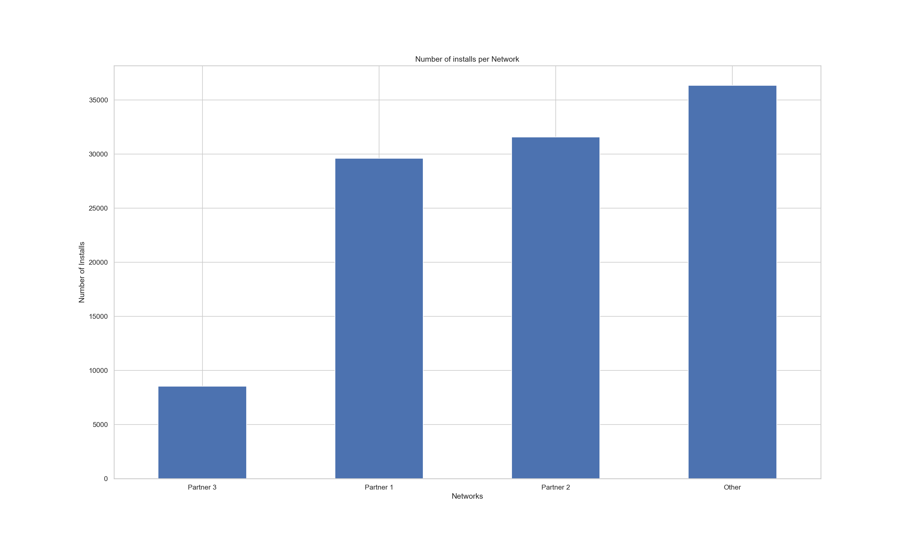

**Observations:** Most of the installs came from the "Other" Network (over 35,000). The "Partner 3" network generated the least amount of installs at less than 10,000.

**SQL Query:**
```sql
SELECT network, COUNT(userid) AS num_installs
FROM installs
GROUP BY network
ORDER BY num_installs DESC;
```


### 2. What was the Cost of Customer Acquisition (CAC) per campaign and network?

#### A. Cost of Customer Acquisition per Campaign

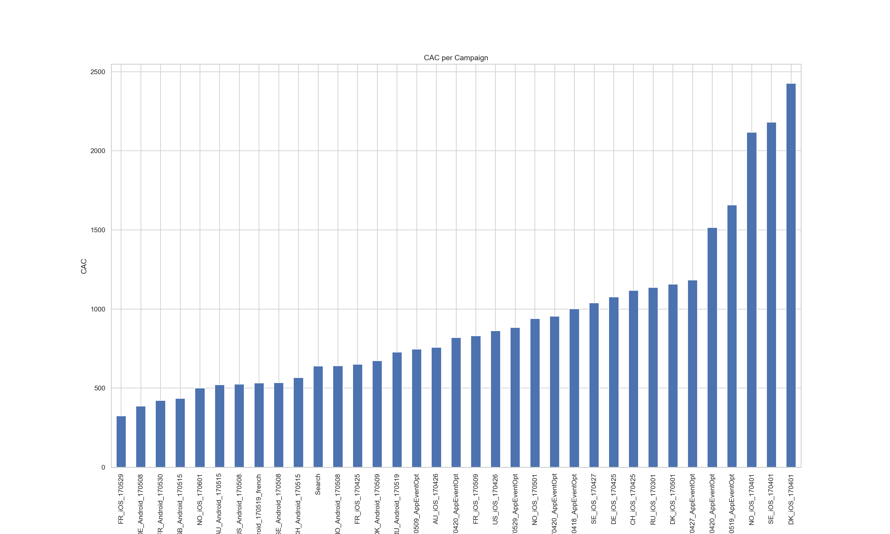


**Observations:** The last 5 campaigns (to the right) had the highest CAC, which means they cost the most per paying customer. It might be worth considering only running the top 20 campaigns (other factors need to be considered before deciding).

**SQL Query:**
```sql
SELECT installs.campaign, ROUND(t.total_cost/COUNT(*), 2) AS cac
FROM (SELECT DISTINCT userid, initial_amount, date FROM subscriptions) AS subs
INNER JOIN installs AS installs ON installs.userid = subs.userid
INNER JOIN (SELECT costs.campaign, SUM(costs.cost) as total_cost
FROM costs AS costs
GROUP BY costs.campaign
ORDER BY total_cost DESC) AS t ON LOWER(installs.campaign) = LOWER(t.campaign)
GROUP BY installs.campaign, total_cost
ORDER BY cac
```

#### B. Cost of Customer Acquisition per Network

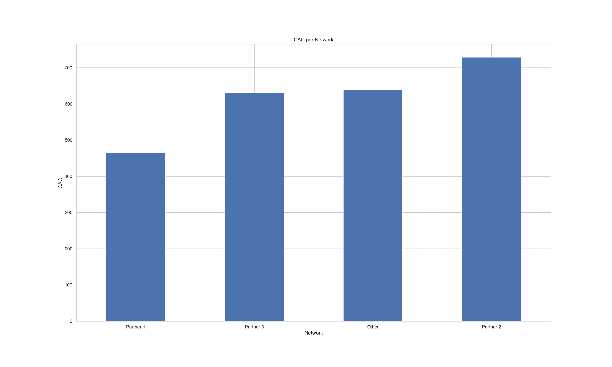

**Observations:** Although the "Other" network generated the most amount of installs out of the 4 networks, its CAC is the third highest. "Partner 2" has the highest cost of customer acquisition.

**SQL Query:**
```sql
SELECT installs.network, ROUND(t.total_cost/COUNT(*), 2) AS cac
FROM (SELECT DISTINCT userid, initial_amount, date FROM subscriptions) AS subs
INNER JOIN installs AS installs ON installs.userid = subs.userid
INNER JOIN (SELECT costs.network, SUM(costs.cost) as total_cost
FROM costs AS costs
GROUP BY costs.network
ORDER BY total_cost DESC) AS t ON LOWER(installs.network) = LOWER(t.network)
GROUP BY installs.network, total_cost
ORDER BY cac
```

### 3. What was the average CAC per platform (iOS or Android)?

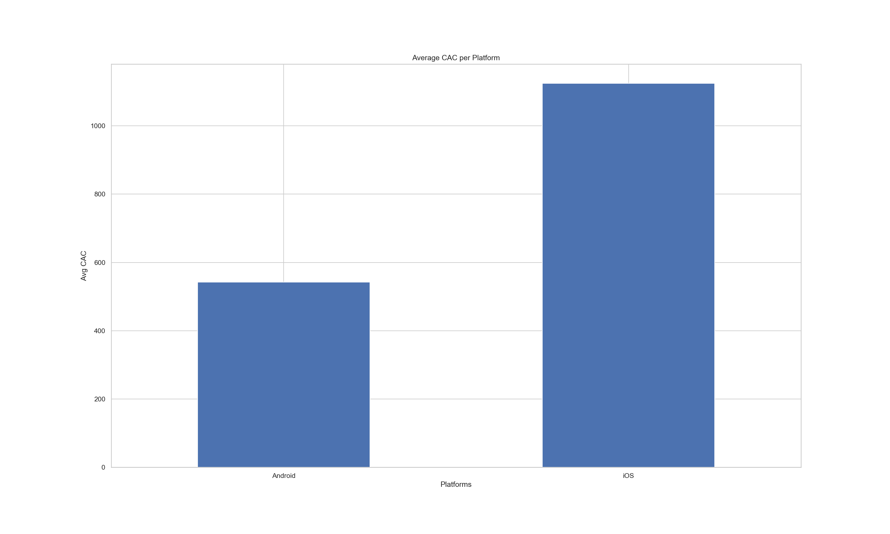

**Observations:** Although the CAC for "iOS" is almost double of the CAC for "Android", the revenue gained from its customers should be considered before deciding whether it is too high. A good metric for this is the ratio LTV:CAC, if the ratio is 1:1 then the team is spending too much.

**SQL Query:**
```sql
SELECT (CASE WHEN p.campaign LIKE '%iOS%' THEN 'iOS' WHEN p.campaign LIKE '%Android%' THEN 'Android' END) AS platform, ROUND(AVG(p.cac), 2) AS cac
FROM (SELECT installs.campaign, ROUND(t.total_cost/COUNT(*), 2) AS cac
FROM (SELECT DISTINCT userid, initial_amount, date FROM subscriptions) AS subs
INNER JOIN installs AS installs ON installs.userid = subs.userid
INNER JOIN (SELECT costs.campaign, SUM(costs.cost) as total_cost
FROM costs AS costs
GROUP BY costs.campaign
ORDER BY total_cost DESC) AS t ON LOWER(installs.campaign) = LOWER(t.campaign)
WHERE installs.campaign LIKE '%iOS%' OR installs.campaign LIKE '%Android%'
GROUP BY installs.campaign, total_cost
ORDER BY cac) AS p
GROUP BY platform
```


### 4. How many subscriptions were sold per campaign and network?

*Note: "Subscriptions" entries with idetical "userid", "initial_amount", and "date", were removed from the calculation since they were considered to be duplicates rather than unique subscriptions.*

#### A. Number of subscriptions sold per Campaign:

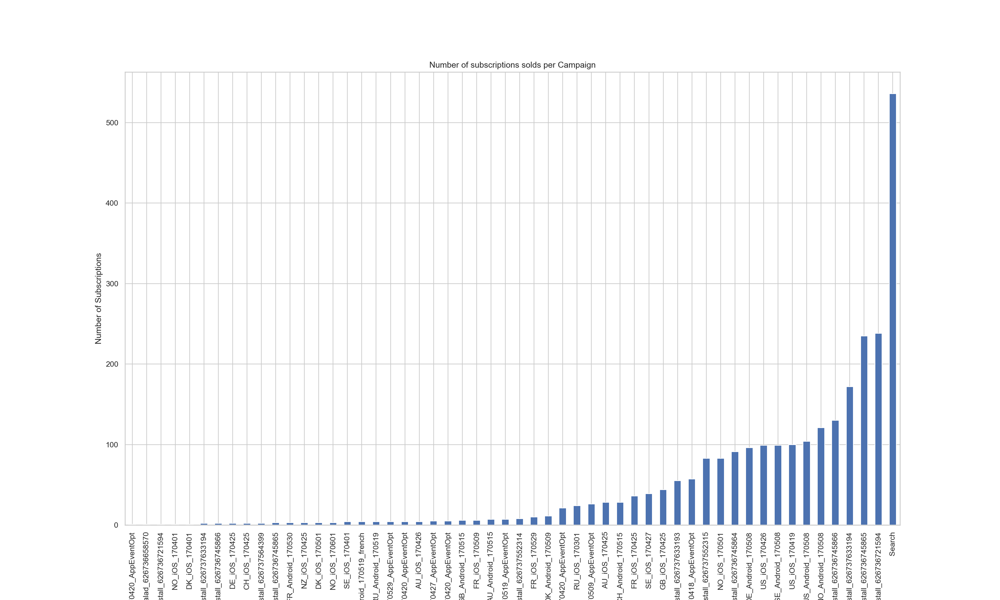


**Observations:** The "Search" campaign clearly generates the highest number of paying customers. 

**SQL Query:**
```sql
SELECT installs.campaign, COUNT(subs.userid) AS num_subs
FROM (SELECT DISTINCT userid, initial_amount, date FROM subscriptions) AS subs
INNER JOIN installs as installs ON installs.userid = subs.userid
GROUP BY installs.campaign
ORDER BY num_subs DESC;
```


#### B. Number of subscriptions sold per Network:

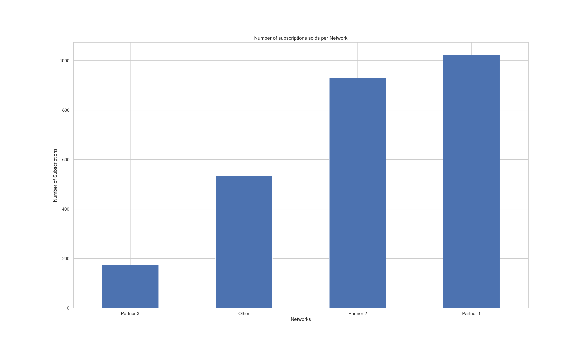

**Observations:** "Partner 1" generates the most number of subscriptions which helps validate why is has the lowest CAC out of the 4 networks.

**SQL Query:**
```sql
SELECT installs.network, COUNT(subs.userid) AS num_subs
FROM (SELECT DISTINCT userid, initial_amount, date FROM subscriptions) AS subs
INNER JOIN installs as installs ON installs.userid = subs.userid
GROUP BY installs.network
ORDER BY num_subs DESC;
```


### 5. What was the initial Return on Investment (ROI) per campaign and network?

#### A. Initial ROI per Campaign:

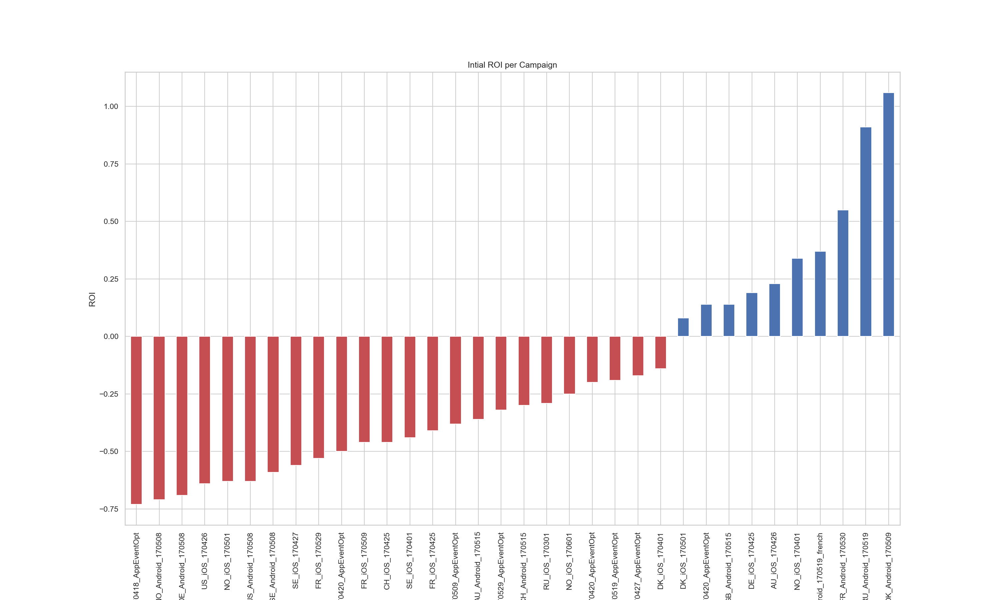

**Observations:** The top 10 campaigns (in blue) have an initial ROI greater than 0. Half of those campaigns are for the "iOS" platform, but the 3 highest initial ROI came from campaigns targeting "Android" users.

**SQL Query:**
```sql
SELECT costs.campaign, ROUND((SUM(subs.initial_amount) - SUM(costs.cost))/SUM(costs.cost), 2) AS roi
FROM costs as costs
INNER JOIN installs as installs ON installs.campaign = costs.campaign
INNER JOIN subscriptions as subs ON subs.userid = installs.userid
GROUP BY costs.campaign
ORDER BY roi DESC;
```


#### B. Initial ROI per Network

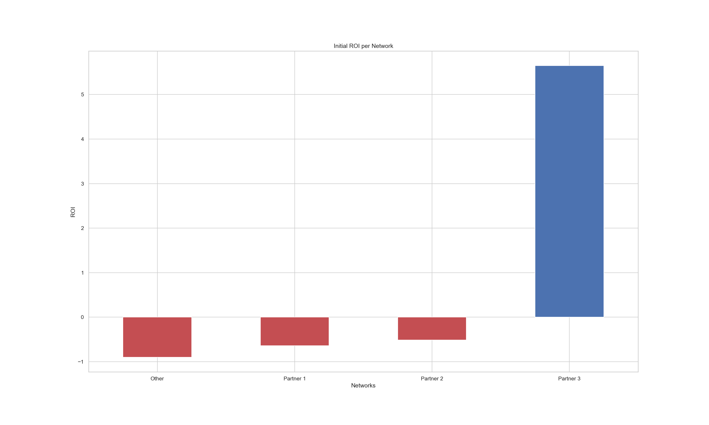

**Observations:** The only positive initial ROI comes from the "Partner 3" network.

**SQL Query:**
```sql
SELECT costs.network, ROUND((SUM(subs.initial_amount) - SUM(costs.cost))/SUM(costs.cost), 2) AS roi
FROM costs as costs
INNER JOIN installs as installs ON installs.network = costs.network
INNER JOIN subscriptions as subs ON subs.userid = installs.userid
GROUP BY costs.network
ORDER BY roi DESC;
```


### 6. Of those users who purchase, what fraction do so on the same day as they installed, one day afterwards, and so on (up to a week) afterwards?

*Note: Out of the 3,7516 unique subscriptions found in the subscriptions table, only 2,664 (7%) of them have a corresponding installed date (that is only 7% of the unique subscription "userid" were found in the "installs" table). Only the subscriptions with an installed date available were used to answer the question.*

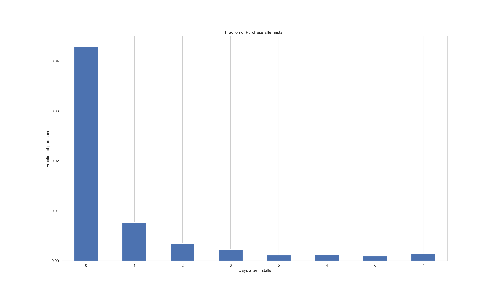

**Observations:** The graph shows that about 60% of the subscriptions (about 15598 subscriptions) happened on the first day of installing the app. Although it may seem like there is a trend, it won't be safe to make any assumptions until a much larger percentage of the unique subscriptions are analysed. 

**SQL Query:**
```sql
SELECT DATE_DIFF(subs.date, installs.date, DAY) AS days_elapsed, ROUND(COUNT(subs.userid)/(SELECT COUNT(subs.userid) FROM (SELECT DISTINCT userid, initial_amount, date FROM subscriptions) as subs INNER JOIN installs ON installs.userid = subs.userid), 4) AS fraction
FROM (SELECT DISTINCT userid, initial_amount, date FROM subscriptions) as subs
INNER JOIN installs ON installs.userid = subs.userid
WHERE DATE_DIFF(subs.date, installs.date, DAY) BETWEEN 0 AND 7
GROUP BY days_elapsed
```


### 7. Assuming the expected Lifetime Value (LTV) for users is according to the table below, which campaigns does it make sense to continue and which should be stopped?

* US - 500
* SE - 400
* NO - 550
* RU - 300
* Others - 350

One way to figure this out is by looking at what country each campaign is targeting (country code in the campaign name, i.e. US, SE, etc...) and only focusing on those countries with the largest LTV, like NO, US and SE. The problem is that this method doesn't take into account the number of users each one of those campaigns generates and it doesn't tell us anything about the "Search" campaign (which doesn't have a country code in its name). A better method is to calculate the number of users per country of each campaign and multiple them by the LTV. Duplicates were not removed from the calculation.


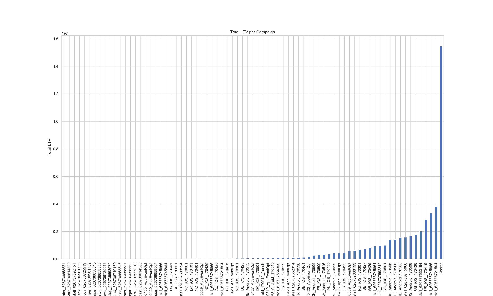


**Observations:** Based on the chart above, the "Search" campaign is generating the largest overall LTV, which means that the team should continue to invest on it. Only the top 10-20 campaigns are generating a significant LTV and the rest might need to be stopped.

**SQL Query:**
```sql
SELECT campaign, SUM(total_count * CASE WHEN LOWER(country) = 'us' THEN 500
WHEN LOWER(country) = 'se' THEN 400
WHEN LOWER(country) = 'no' THEN 550
WHEN LOWER(country) = 'ru' THEN 300
ELSE 350
END) AS total_ltv
FROM (SELECT COUNT(*) as total_count, campaign, country
FROM installs
GROUP BY campaign, country) AS t
GROUP BY campaign
ORDER BY total_ltv DESC
```
